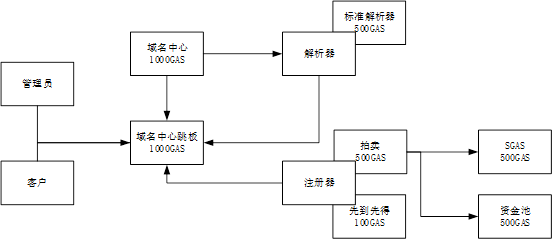

NNS 合约关系指南

以下内容在白皮书均可见，此处集中整理一下

合约关系
========

如下图

NNS体系智能合约目前共六个

1.域名中心***********************************0x99000f983390d88b6367548e0773e0a701f3af97

2.域名中心跳板***********************************0x77e193f1af44a61ed3613e6e3442a0fc809bb4b8

3.标准解析器***********************************0xcf0d21eaa1803f63704ddb06c373c22d815b7ca2

4.先到先得注册器***********************************0x564be8c75535a5382ed530a447b7be2cafa0be19

5.拍卖注册器***********************************0xf72808435fd52e55351c3a6c2c39fd9c3b1615a4

6.SGAS***********************************0x2761020e5e6dfcd8d37fdd50ff98fa0f93bccf54

7.nnc ***********************************0x7c488f873d2fa3c2ccc4c8af8dbec83678111778

域名中心
--------

域名中心是管理所有域名的合约，存储了域名的所有权信息

域名所有权信息包括域名的拥有者、解析器、注册器、过期时间等

他需要存储特性 +400gas

当域名解析时，域名中心会动态找到域名对应的解析器，然后动态调用他

需要动态调用特性NEP4 +500gas

有一个通知，通知名字是changeOwnerInfo,参数是(byte[] namehash, OwnerInfo addr, bool newdomain)
        public class OwnerInfo
        {
            public byte[] owner;//如果长度=0 表示没有初始化
            public byte[] register;
            public byte[] resolver;
            public BigInteger TTL;
            public byte[] parentOwner;//当此域名注册时，他爹的所有者，记录这个，则可以检测域名的爹变了
            //nameinfo 整合到一起
            public string domain;//如果长度=0 表示没有初始化
            public byte[] parenthash;
            public BigInteger root;//是不是根合约
        }

域名中心跳板
------------

域名中心跳板是在测试阶段很重要的合约，他将调用透明转发给域名中心，自身很少修改。

因为需要存储域名中心的地址（可变）+400gas

需要动态调用域名中心（可变）+500gas

标准解析器
----------

标准解析器由用户的所有者通过域名中心配置，可变。

标准解析器自己存储自身管理的解析配置，需要存储+400gas

标准解析器*通过静态调用appcall 调用域名中心查询域名状态*

有一个通知，通知名字是setResolveData,参数是(byte[] namehash, string protocol, byte[] data)

先到先得注册器
--------------

先到先得注册器主要由管理员初始化域名根时配置，用户管理自己的下级域名，通常直接解析即可，不用注册下级域名。如需要注册下级域名，再说。

先到先得注册器不需要存储

先到先得注册器通过静态调用appcall 调用域名中心查询域名状态与注册域名

拍卖注册器
----------

拍卖注册器主要由管理员初始化域名根时配置

拍卖注册器需要存储拍卖信息与用户资金，需要存储+400gas

拍卖注册器通过静态调用appcall 调用域名中心查询域名状态与注册域名

拍卖注册器通过静态调用appcall 调用SGAS合约处理用户充值与提现（拍卖费用）

拍卖注册器通过静态调用appcall 调用资金池合约处理租金和拍卖费用

有一个通知，一个通知名字是domainstate,参数是(SellingState sellingState)
          第二个通知名字是addprice，参数是(byte[] who, SellingState sellingState, BigInteger value)
        public class SellingState
        {
            public byte[] id; //拍卖id,就是拍卖生成的txid

            public byte[] parenthash;//拍卖内容
            public string domain;//拍卖内容
            public BigInteger domainTTL;//域名的TTL,用这个信息来判断域名是否发生了变化

            public BigInteger startBlockSelling;//开始销售块
            //public int StartTime 算出
            //step2time //算出
            //rantime //算出
            //endtime //算出
            //最终领取时间 算出,如果超出最终领取时间没有领域名,就不让领了
            //public BigInteger startBlockRan;//当第一个在rantime~endtime之后出价的人,记录他出价的块
            //这个变量移除,改为运算更少的随机块决定方式
            //从这个块开始,往后的每一个块出价都有一定几率直接结束
            public BigInteger endBlock;//结束块

            public BigInteger maxPrice;//最高出价
            public byte[] maxBuyer;//最大出价者
            public BigInteger lastBlock;//最后出价块
        }          

SGAS合约
--------

SGAS合约是一个1比1锚定了GAS的代币，他主要是一个拓展了NEP5功能实现的代币（支持转账证明和智能合约交易的扩展）

SGAS并非NNS专用，是NNS选用了SGAS来做燃料币。因为SGAS的价值与GAS锚定，并且可以直接使用智能合约相互兑换，所以我们在文中不需要区分SGAS和GAS，直接说GAS。

智能合约直接使用GAS不方便，但是使用SGAS就方便了很多

有一个通知，一个通知名字是transfer,参数是(byte[] from, byte[] to, BigInteger value)
          第二个通知名字是onRefundTarget，参数是(byte[] txid, byte[] who)

资金池合约
----------

资金池合约是一个管理租金和拍卖所得的SGAS的合约，资金池合约实现一个类似POS的机制，根据NNC的持有量（NNC为一个UTXO资产），分享资金池中的SGAS

有一个通知，一个通知名字是transfer,参数是(byte[] from, byte[] to, BigInteger value)

合约部署
========

部署域名中心跳板
----------------

### 部署方法

直接部署域名中心合约

例如：域名中心跳板 hash=0x954f285a93eed7b4aed9396a7806a5812f1a5950

域名中心跳板因为逻辑简单，出bug概率很低，不会经常更改。

域名中心跳板只是作为一个域名中心的hash不会变更的转发层。

即使没有域名中心跳板，并不影响整套系统工作。

### 验证方式：

检查合约是否部署成功

部署域名中心跳板
----------------

### 部署方法

1.修改域名中心代码的jumpContract变量后部署

例如：jumpContract=0x954f285a93eed7b4aed9396a7806a5812f1a5950

例如：域名中心hash=0x2b881a0998cb8e91783b8d671e0f0f42adf4840f

此设计让并非任意合约都可以做跳板，仅有跳板合约的调用是允许的。

2.然后调用（发交易方式）域名中心跳板的

\_setTarget(0x2b881a0998cb8e91783b8d671e0f0f42adf4840f)

配置跳板目标

### 验证方式

配置完成后可以调用(invoke方式) 域名中心跳板的name() 来验证

域名中心跳板并没有name这个方法，他会转发给他的target，也就是域名中心

部署标准解析器合约
------------------

### 部署方法

修改标准解析器代码中的rootcall指向的合约地址

例如：

>   [Appcall("954f285a93eed7b4aed9396a7806a5812f1a5950")]

>   static extern object rootCall(string method, object[] arr);

解析器需要调用域名中心查询域名情况

这个appcall配置为域名中心和域名中心跳板都可以

### 验证方式

验证合约是否部署即可，解析器的调用要在有域名的情况下，无法立即验证

部署先到先得注册器合约
----------------------

### 部署方法

修改标准解析器代码中的rootcall指向的合约地址

然后部署合约

### 验证方式

验证合约是否部署即可，注册器的调用要在有域名的情况下，无法立即验证

五、部署SGAS合约
----------------

### 部署方法：

直接部署合约

例如合约hash= bab964febd82c9629cc583596975f51811f25f47

### 验证方式

SGAS合约是个nep5合约，可以用对nep5合约的验证方法验证

部署资金池合约
--------------

### 部署方法：

直接部署

### 验证方式

有资金池相应例子用于测试

部署拍卖注册器合约
------------------

### 部署方法

1.  修改拍卖注册器代码中的rootcall指向的合约地址为域名中心或者域名中心跳板

2.  修改拍卖注册期代码中sgascall指向的合约地址为sgas合约地址

例如：

[Appcall("bab964febd82c9629cc583596975f51811f25f47")]

static extern object sgasCall(string method, object[] arr);

3.修改拍卖注册器代码中的coinpoolCall指向合约地址为资金池合约地址

### 验证方式

拍卖注册器里面可以暂存nnc与取回，可以直接测试

Setmoneyin

Getmoneyback

BalanceOf

接口

合约使用
========

主要流程

一、管理员域名中心_setTarget
----------------------------

已经在部署中描述，不再说明

二、管理员域名中心initRoot
--------------------------

这个流程是管理员初始化根域名并指定根域名的注册器

直接调用（发交易方式）域名中心initRoot方法即可

参考smartcontactdemo nns_admin

### 验证方式

设置后getOwnerInfo 可查根域名变化

三、用户获取先到先得域名
------------------------

目前标准配置 .test 域名为先到先得域名

1.  用户先调用（invoke方式）域名中心getOwnerInfo，获取.test对应的注册器

2.  用户调用（发交易方式）注册器的requestSubDomain方法获取域名所有权

参考smartcontactdemo nns user

### 验证方式

GetOwnerInfo可查域名变化

四、用户配置自己的域名解析
--------------------------

1.用户调用（发交易方式）域名中心owner_SetResolver配置自己的域名解析器

2.用户调用（invoke方式）域名中心owner_getOwnerInfo验证自己域名的解析器成功配置

如已经配置，12步不用再做

1.  用户调用（发交易方式）解析器setResolveData配置解析数据

参考smartcontactdemo nns user

### 验证方式

用流程五验证

五、解析域名
------------

调用（invoke方式）域名中心的resolve方法

拍卖域名
--------

目前标准配置 .sell域名为拍卖域名

1用户先调用（invoke方式）域名中心getOwnerInfo，获取.sell对应的注册器

2.用户调用（发交易方式）注册器的wantBuy方法，申请开始拍卖一个子域名

3.用户调用（发交易方式）注册器的addPrice方法，加价

4.用户调用（发交易方式）注册器的endSelling方法，结束拍卖，取回自己的钱（未中标）

或者交出自己的钱（已中标）

5.用户调用（发交易方式）注册器的getSellingDomain方法，取得自己拍得域名得所有权

参考smartcontactdemo nns sell

### 验证方式

拍卖合约有很多接口可用于验证

getSellingStateByFullhash 用域名得hash，查拍卖状态

balanceOfSelling 用拍卖id，查询我得出价

往拍卖合约充钱和取回
--------------------

参考smartcontract demo nc 1 2 3
